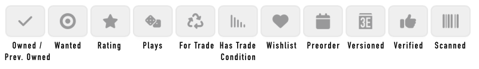
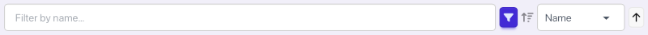

# ShelfScan.io Workflows

For all workflows, make sure that you have 'signed in' with your BGG username,
and that you have recently refreshed your collection data using the 'Refresh Collection' button in
the navigation menu.

If a workflow requires the [ShelfScan Extension](https://www.shelfscan.io/extension),
make sure that you have it installed in your browser, that you are an active
[BGG Supporter](https://boardgamegeek.com/support) or Free Trial user. Also make sure that
you have logged into
BGG with the same user with which you 'signed in' to ShelfScan.

- [Initial Collection Loading](#initial-collection-loading)
- [Collection Maintenance](#collection-maintenance)
- [Collection Audit](#collection-audit)
- [Collection Quick Filtering](#collection-quick-filtering)
<!-- - Trade Preparation
- Quick Market Listings
- Bulk Ratings -->

For most uses of ShelfScan, we recommend using the same mobile device.  The larger the screen, the
easier it will be to use the application.  A small tablet or a phone with a large screen will work well.

## Initial Collection Loading

ShelfScan provides a streamlined process for the initial loading of your collection into BGG.

This workflow requires the [ShelfScan Extension](https://www.shelfscan.io/extension) to be installed
in
your browser, and for you to be an active [BGG Supporter](https://boardgamegeek.com/support) or
Free Trial user.

Simply go to https://www.shelfscan.io/batch (Batch Scan in the navigation) and begin scanning
game UPCs using your camera.

There are separate tabs for games that are already in your
collection and freshly scanned games, so you can make sure you don't accidentally add duplicates.

When you're done with a grouping of games, click the 'Add [X] Games to Collection' button to add
the games to your BGG collection. You can add duplicates of owned games if you are on the 'Owned'
tab when you click the button.

The symbol on the ShelfScan extension will spin, indicating that the BGG update is in progress.
Once the symbol stops spinning, the games will have been added to your collection.

# Collection Maintenance

It is simple to maintain an existing BGG collection with ShelfScan as games are added and removed.

This workflow requires the [ShelfScan Extension](https://www.shelfscan.io/extension) to be installed
in
your browser, and for you to be an active [BGG Supporter](https://boardgamegeek.com/support) or
Free Trial user.

When you acquire new games, add them with the same Batch Scan workflow as described above,
or on the [Individual Scan](https://www.shelfscan.io) view.

The Individual Scan view allows you to have more control over the details of the game in your
collection, particularly the version of the game that you own. It also puts verification of the
mapping between the scanned UPC and the BGG version of the game front and center, which helps to
build confidence in the accuracy of everyone's scans.

To remove a game from your collection:

- Scan the game from the Individual Scan view
- Click through to the game details page
- Make sure that the game is marked as in your collection (a checkmark appears at the top of the
  page)
- Make sure that 'Update in Collection' is switched on, in the bottom of the action area, to the
  right of the game's thumbnail image
- Click the arrow next to the 'Set Info' button/dropdown (the first one) and select 'Clear Statuses'
- Make sure that the 'Remove' switch near the button is turned on
- Click the 'Clear' button to remove the game from your collection

As with other workflows, the symbol on the ShelfScan extension will spin, indicating that the BGG
update is in progress. Once the symbol stops spinning, the game will have been removed
from your collection.

Beyond 'Add', and 'Clear Status' discussed above, there are many other collection status update
actions you can
take from
the details page using the first button, such as setting the game as 'For Trade' and indicating the
trade condition.

All the current 'Add' actions are:

- Add to Owned
- Add for Trade
- Add to Wishlist
- Add to Market

All the current 'Update' actions are:

- Set Info (game and version)
- Set Trade Info (trade condition and for trade status)
- Set Previously Owned (clears owned status)
- Clear Statuses (clears all statuses, including owned, for trade, wishlist, etc.)
- Add to Market
- Private Info (set private info such as price paid, acquisition date, etc.)

An appropriate form will appear as needed for each of these actions.

## Collection Audit

ShelfScan's collection audit workflow allows you to quickly verify the accuracy of your collection
data on BGG, and make additions and subtractions as needed.

This workflow requires the [ShelfScan Extension](https://www.shelfscan.io/extension) to be installed
in
your browser, and for you to be an active [BGG Supporter](https://boardgamegeek.com/support) or
Free Trial user.

*Users who do not have the extension can still perform an audit by scanning games, but all BGG
updates will need to be done manually.*

For an audit, we expect that you are starting with a collection that has already been loaded onto
BGG,
and that you have physical games in front of you.

Scan the games from the [Individual Scan](https://www.shelfscan.io) view.

Next, you should either click through to the game details page for each scan if you want to
audit game-by-game, or you can continue scanning games.

### Clicking Through

If you find a game that is not in your collection, or that has incorrect information, you can update
the collection information directly from the details page, as described in the Collection
Maintenance workflow above.

### Continuing to Scan

With this variant of the workflow, you will scan all or a subset of your games, and then go to the
collection view to review which scanned games are not in your collection.

### After Scanning

After you have completed scanning, you can go to the
[Collection View](https://www.shelfscan.io/collection) to review the games which you scanned 
that are not in your collection and review the games in your collection that you did not scan.

To see the games that are not in your collection, click the 'Not in Collection' tab.

To see the games that are in your collection but not scanned, click on the 'Scanned' filter button
until it turns red with an X mark in the bottom right corner, which limits the games shown to 
those that do not appear in the scan history that is saved on your device.

## Collection Quick Filtering

ShelfScan provides the ability to quickly filter your collection by various criteria, and to sort
the filtered collection by several different attributes.

The [ShelfScan Extension](https://www.shelfscan.io/extension) is **not** required for this workflow,
and the [Collection View](https://www.shelfscan.io/collection) in general is available to all users.

Above you can see the quick filter buttons and what filtering they are associated with.

Most filters have an 'on', 'not', and 'off' state, which you toggle through by clicking on the button.

In the 'on' state, only games that match the filter criteria will be shown.

In the 'not' state, only games that do not match the filter criteria will be shown.

In the 'off' state, the filter is not applied and all games will be shown regardless of that criteria.

Some filters, such as the 'Rating' and 'Plays' filters, also have min and max input fields to allow
you to narrow the results to a specific range.  The 'Wishlist' filter also has a parameter - a 
priority selection dropdown.

You can combine multiple filters to narrow your search and find just the games you are 
interested in.  For example, you could select an 'Owned' filter and 'Rating' filter, and enter min
and max rating values to find all the games in your collection that you have rated poorly.

The top of the filter section shows a title text search, a button to turn the filter button bar off,
the sorting options, and a button to change the sort direction.

## Collection View

https://youtu.be/2aulGJ4WqMM

## Batch Scan

https://youtube.com/shorts/XI_wbk324hU

## Detailed Play Logging

https://youtu.be/xNvMz3CrDRU
